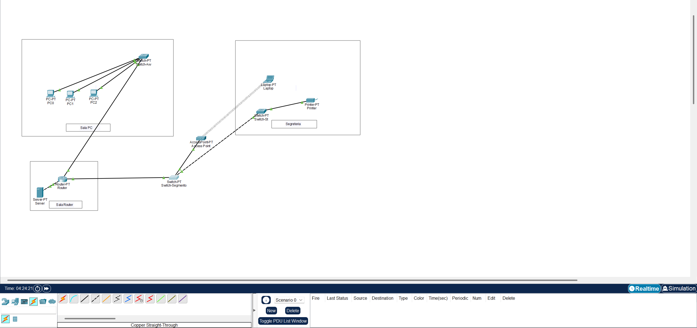

# Secure Corporate Network Architecture – Cisco Packet Tracer

## ⚠️ Important Disclaimer & Academic Integrity
- **Personal & Educational Project:** This repository showcases a personal, educational hands-on project developed entirely by me. It does **not** represent a real deployed corporate infrastructure, and "Rossi & Associati" is a fictional entity used solely for scenario-modeling purposes.
- **Academic Integrity Notice:** You are welcome to explore, study, and learn from this configuration. However, **plagiarism is strictly prohibited**. Do not copy, replicate, or claim this project, its documentation, or its network topologies as your own work for academic submissions, certifications, or professional portfolios.

## 📌 Project Overview & Requirements
The fictional client required a complete overhaul of their network infrastructure to meet privacy and cybersecurity standards:
- **Logical & Physical Segmentation:** Isolating high-privileged corporate devices (Lawyers) from low-privileged/public networks (Reception & Guest Wi-Fi).
- **Automated IP Management:** Eliminating manual static assignments by deploying local DHCP pools.
- **Granular Traffic Control:** Implementing strict firewall-like rules to prevent unauthorized lateral movement between subnets while keeping shared resources (Printers) and Internet routing functional.
- **Infrastructure Hardening:** Securing physical switchports against unauthorized rogue devices and replacing unencrypted management protocols with cryptographic alternatives.

---

## 🗺️ Network Topology

*Figure 1: Complete network diagram illustrating physical separation and structural links.*

---

## 🔢 Subnetting Plan (Class C /25 Split)
To optimize address space and create strong network boundaries, a single Class C network (`192.168.0.0/24`) was subnetted into two distinct `/25` masks (`255.255.255.128`):

| Subnet Name | Network ID | IP Range | Default Gateway | Purpose |
| :--- | :--- | :--- | :--- | :--- |
| **Staff & Wi-Fi** | `192.168.0.0/25` | `192.168.0.2 - 192.168.0.126` | `192.168.0.1` | Reception, Printer, Access Point (Guests) |
| **Corporate (Lawyers)** | `192.168.0.128/25` | `192.168.0.130 - 192.168.0.254` | `192.168.0.129` | Confidential legal case files & workstations |

---

## 🔒 Implemented Security Features

### 1. Centralized DHCP Services
The border router (`Router`) acts as a local DHCP server, dynamically allocating addresses to endpoints based on the ingress interface, preventing rogue IP conflicts:
- `POOL_SEGRETERIA` targeting `192.168.0.0/25`
- `POOL_AVVOCATI` targeting `192.168.0.128/25`

### 2. Extended Access Control Lists (Stateless Firewalling)
To implement the **Principle of Least Privilege**, an Extended ACL (ID `100`) was applied **inbound** on the Staff interface. It enforces strict top-down evaluation:
1. **Exception Rule:** Explicitly permits the shared network printer (`host 192.168.0.5`) to send return traffic back to the Corporate Subnet.
2. **Isolation Rule:** Block all other IP packets originating from the Staff network heading towards the Corporate network (`192.168.0.128 0.0.0.127`).
3. **External Access:** Permits all remaining IP traffic (`permit ip any any`) ensuring uninterrupted Internet access to `8.8.8.8`.

### 3. Layer 2 Port Security (Physical Hardening)
To mitigate "rogue device" threats where an insider or visitor unplugged office equipment (e.g., the printer) to bridge their laptop into the infrastructure:
- Enabled **Port Security** on `Switch-St`.
- Applied **Sticky MAC Address** learning to bind the specific hardware signature of the printer to its designated switchport.
- Set the violation mode to **Shutdown**. Any alien MAC address automatically forces the port into an `err-disabled` state, requiring administrative intervention (`shutdown` / `no shutdown`) to restore operations.

### 4. Cryptographic Remote Access (SSHv2 Deployment)
Disabled unencrypted legacy management utilities (Telnet) to shield administrative credentials from packet-sniffing/Man-in-the-Middle attacks. 
- Generated **RSA Crypto Keys** (2048-bit modulus minimum).
- Configured local authentication databases on the Virtual Type Terminal lines (`line vty 0 15`).
- Enforced `transport input ssh`, allowing secure remote shell operations exclusively.

---

## 🧪 Verification & Testing Matrix

| Source Endpoint | Destination Endpoint | Protocol | Expected Result | Business Validation |
| :--- | :--- | :--- | :--- | :--- |
| Staff Laptop | Internet (`8.8.8.8`) | ICMP (Ping) | **SUCCESS** | Staff/Guests can browse the Web |
| Staff Laptop | Lawyer PC (`192.168.0.130`) | ICMP (Ping) | **BLOCKED** | Perimeter Protection / Microsegmentation |
| Lawyer PC | Printer (`192.168.0.5`) | ICMP (Ping) | **SUCCESS** | Business continuity for corporate printing |
| Rogue Laptop | Printer Switchport | Any | **PORT SHUTDOWN** | Hardware spoofing and physical breach mitigation |

---

## 🔐 Lab Credentials (Demo Purposes Only)
For demonstration and testing purposes within Cisco Packet Tracer, the following credentials have been configured:

- **Enable Password (Router & Switches):** `cisco123`
- **SSH Remote Access Username:** `admin`
- **SSH Remote Access Password:** `Superpassword!`

*Note: To connect via SSH from a workstation inside Packet Tracer, open the Command Prompt and run:*
```bash
ssh -l admin 192.168.0.129
```
---

## 🛠️ How to Run the Project
1. Download and install **Cisco Packet Tracer**.
2. Clone this repository: `git clone https://github.com/Fabrizio-Pet/secure-cisco-network-office.git`
3. Open `Secure_Office_Network.pkt` inside Packet Tracer.
4. Review raw IOS commands inside the `configs/` directory.
